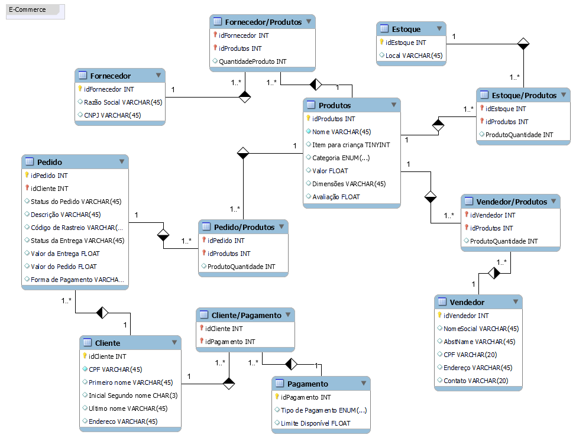

# Projeto Lógico - ECommerce

Desafio da plataforma [DIO](https://dio.me) (Digital Innovation One), no bootcamp [Database Experience](https://web.dio.me/track/database-experience).

## Sobre o desafio
O desafio consiste em realizar um projeto lógico de um ambiente de ECommerce, entendendo o negócio, realizando o levantamento de requisitos, construindo o modelo conceitual e criando o script do banco de dados em questão.

## Narrativa
### Produto
- Os produtos são vendidos por uma única plataforma online.
  Contudo, estes podem ter vendedores distintos (terceiros);
- Cada produto possui um fornecedor;
- Um ou mais produtos podem compor um pedido.

### Cliente
- O cliente pode se cadastrar no site com seu CPF ou CNPJ;
- O Endereço do cliente irá determinar o valor do frete;
- Um cliente pode comprar mais de um pedido. Este tem um período de carência para devolução do produto.

### Pedido
- O pedidos são criados por clientes e possuem informaçöes de compra, endereço e status da entrega;
- Um produto ou mais compoem o pedido;
- O pedido pode ser cancelado.

### Estoque
- O estoque possui produtos;
- Um ou mais produtos podem compor o estoque;
- o estoque possui um local;

### Fornecedor
- O fornecedor deve possuir CNPJ;
- O fornecedor deve possuir razão social;
- Um fornecedor pode fornecer vários produtos

[Modelo antigo](https://github.com/vncs31/Ecommerce-projeto-conceitual)
## Modelo Conceitual


<details>
  <summary><h2>Script SQL</h2></summary>
  
#### Criando o banco de dados para o cenário de E-commerce e utilizando.
```
create DATABASE ecommerce;
use ecommerce;
```
<details>
  <summary><h4>Criação das tabelas e relacionamentos</h4></summary>
  
### Criação de tabelas
#### Criação da tabela Cliente
```
create table clients(
    idClient int auto_increment primary key,
    Fname varchar(10),
    Minit char(3),
    Lname varchar(20),
    CPF char(11) not null,
    Address varchar(30),
    constraint unique_cpf_client unique(CPF)
);
```

#### Criação da tabela Produto
```
create table product(
    idProduct int auto_increment primary key,
    Pname varchar(0) not null,
    classification_kids bool,
    category enum('Eletrônico', 'Vestimenta', 'Brinquedos', 'Alimentos', 'Moveis') default 'Eletronico',
    avaliacao float default 0,
    size varchar(10)
);
```
#### Criação da tabela Pagamento
```
create table payment(
    idPayment int auto_increment primary key,
    typePayment enum('Boleto', 'Cartão', 'Dois cartões'),
    limitAvailable float
);
```
#### Criação da tabela de relação Cliente/Pagamento
```
create table clientsPayment(
    idPayment int,
    idClient int,
    primary key(idClient, idPayment),
    constraint fk_payment_client foreign key (idClient) references clients(idClient),
    constraint fk_payment_payment foreign key (idPayment) references payment(idPayment)
);
```
#### Criação da tabela Pedido
```
create table orders(
    idOrder int auto_increment primary key,
    idOrderClient int,
    orderStatus enum('Cancelado', 'Confirmado', 'Processamento') default 'Processamento',
    orderDescription varchar(255),
    sendValue float default 10,
    paymentCash bool default false,
    constraint fk_orders_client foreign key (idOrderClient) references clients(idClient)
      on update cascade
      on delete set null
);
```
#### Criação da tabela Estoque
```
CREATE TABLE storageLocation(
    idStorageLocation int auto_increment primary key,
    location varchar(255)
);
```
#### Criação da tabela de relação Produto/Estoque
```
create table productStorage(
    idPSproduct int,
    idPSstorage int,
    prodQuantity int default 0,
    PRIMARY KEY(idPSproduct, idPSstorage),
    CONSTRAINT fk_storage_location_product FOREIGN KEY (idPSproduct) REFERENCES product(idProduct),
    CONSTRAINT fk_storage_location_storage FOREIGN KEY (idPSstorage) REFERENCES storageLocation(idStorageLocation)
);
```
#### Criação da tabela Fornecedor
```
create table supplier(
    idSupplier int auto_increment primary key,
    SocialName varchar(255) not null,
    CNPJ char(15) not null,
    contact char(11) not null,
    constraint unique_cnpj_supplier unique (CNPJ)
);
```
#### Criação da tabela Vendedor
```
create table seller(
    idSeller int auto_increment primary key,
    SocialName varchar(255) not null,
    AbstName varchar(255) not null,
    CPF char(20) not null,
    location varchar(255),
    contact char(20) not null,
    constraint unique_cpf_seller unique (CPF)
);
```
#### Criação da tabela de relação Produto/Vendedor
```
create table productSeller(
    idPseller int,
    idProduct int,
    prodQuantity int default 1,
    primary key (idPseller, idProduct),
    CONSTRAINT fk_product_seller FOREIGN KEY (idPseller) REFERENCES seller(idSeller),
    CONSTRAINT fk_product_product FOREIGN KEY (idProduct) REFERENCES product(idProduct)
);
```
#### Criação da tabela de relação Produto/Pedido
```
CREATE TABLE productOrder(
    idPOproduct int,
    idPOorder int,
    poQuantity int DEFAULT 1,
    poStatus enum('Disponível', 'Sem estoque') default 'Disponível',
    PRIMARY KEY(idPOproduct, idPOorder),
    CONSTRAINT fk_productorder_seller FOREIGN KEY (idPOproduct) REFERENCES product(idProduct),
    CONSTRAINT fk_productorder_product FOREIGN KEY (idPOorder) REFERENCES orders(idOrder)
);
```
  </details>
<details>
<summary><h4>Inserindo dados nas tabelas</h4></summary>
  
#### POPULAR A TABELA CLIENTES
```
insert into clients (Fname, Minit, Lname, CPF, Address)
    values('Anderson', 'G', 'Silva', '123456789', 'Rua vermelho 16 - cidade 58'),
          ('Beatriz', 'A', 'Santos', '987654321', 'Rua azul 45- cidade 58'),
          ('Carlos', 'E', 'Fernandes', '111222333', 'Rua roxo 19 - cidade 58'),
          ('Denise', 'D', 'Cavalcante', '02012013045', 'Rua amarelo 46 - cidade 58'),
          ('Everton', 'P', 'Pereira', '95115935720', 'Rua branco 75 - cidade 58'),
          ('Vinícius', 'O.', 'Guedes', '26912172182', 'Brasília - DF');
```
#### POPULAR A TABELA PRODUTO
```
insert into product (Pname, classification_kids, category, avaliacao, size) 
    values('Fone', false, 'Eletrônico', '4', null),
          ('Celular', false, 'Eletrônico', '5', null),
          ('Mouse', false, 'Eletrônico', '3', null),
          ('Carrinho', true, 'Brinquedos', '4', null),
          ('Sofá', false, 'Móveis', '2', '4x80x50'),
          ('Camisa', false, 'Vestimenta', '1', null);
```
#### POPULAR A TABELA PEDIDO
```
insert into orders (idOrderClient, orderStatus, sendValue, paymentCash)
    values(1, default, 10, 1),
          (2, 'Cancelado', 50, 0),
          (3, 'Confirmado', 150, 1),
          (4, 'Confirmado', null, 1),
          (5, default, null, 0);
```
#### POPULAR A TABELA VENDEDOR
```
insert into seller (SocialName, AbstName, CPF, location, contact) 
    values('José', 'Silva', '243456789', 'São Paulo', '(19) 91010-2020'),
          ('Pedro', 'Pereira', '987654321', 'São Paulo', '(13) 91613-2570'),
          ('Camila', 'Sabrina', '156156497', 'Minas Gerais', '(85) 91894-1065'),
          ('Derik', 'Dante', '4892561795', 'Brasília', '(61) 99841-8974'),
          ('Jilberto', 'Jonas', '189745045', 'Espirito Santo', '(91) 91189-2492');
```
#### POPULAR A TABELA PRODUTO/VENDEDOR
```
insert into productSeller (idPseller, idProduct, prodQuantity)
    values(1, 13, 5),
          (2, 14, 4),
          (3, 15, 9),
          (4, 16, 18),
          (5, 17, 2),
          (5, 15, 12),
          (5, 13, 20);
```
#### POPULAR A TABELA FORNECEDOR
```
insert into supplier (SocialName, CNPJ, contact)
    values('Mercado Brasileiro', '123456789101145', 'mrcdbr@gmail.com'),
          ('Mercado Português', '876543219101234', 'mrcdpt@gmail.com');
```
#### POPULAR A TABELA ESTOQUE
```
insert into storageLocation (location)
    values('São Paulo'),
          ('Belo Horizonte'),
          ('Salvador'),
          ('Goiás'),
          ('Brasília');
```
#### POPULAR A TABELA PRODUTO/ESTOQUE
```
insert into productStorage (idPSproduct, idPSstorage, prodQuantity)
    values(13, 1, 504),
          (14, 1, 228),
          (15, 2, 316),
          (16, 2, 196),
          (17, 5, 87);
```
#### POPULAR A TABELA PRODUTO/PEDIDO
```
insert into productOrder (idPOproduct, idPOorder, poQuantity, poStatus)
    values(13, 1, 3, default),
          (14, 1, 5, 'Sem estoque'),
          (15, 1, 1, default),
          (16, 2, 1, default),
          (14, 2, 1, 'Sem estoque'),
          (15, 3, 6, default),
          (16, 4, 9, default),
          (17, 5, 12, 'Sem estoque');
```
#### POPULAR A TABELA PAGAMENTO
```
insert into payment(typePayment, limitAvailable)
    values('Boleto', null),
          ('Cartão', 500),
          ('Cartão', 100),
          ('Cartão', 3000),
          ('Dois cartões', 10000);
```
#### POPULAR A TABELA CLIENTE/PAGAMENTO
```
insert into clientsPayment(idPayment, idClient)
    values(1, 1),
          (1, 2),
          (1, 3),
          (2, 4),
          (2, 5),
          (5, 6);
```
</details>
